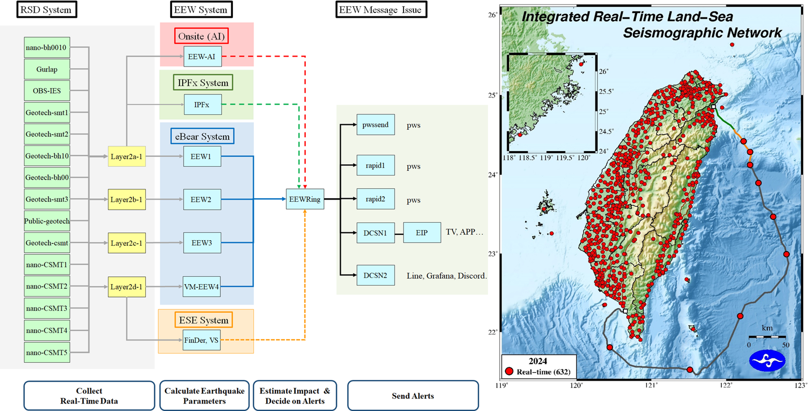
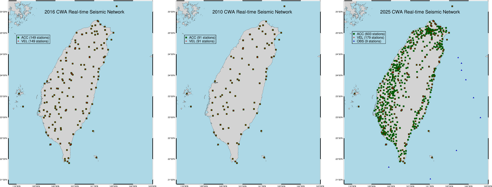
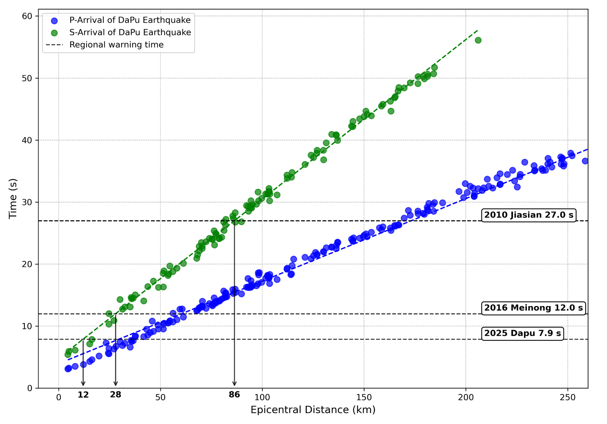
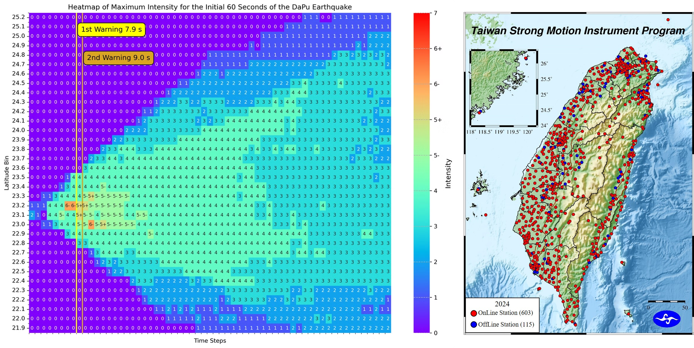
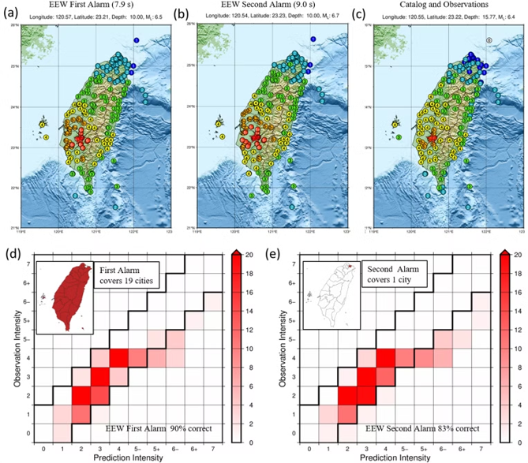
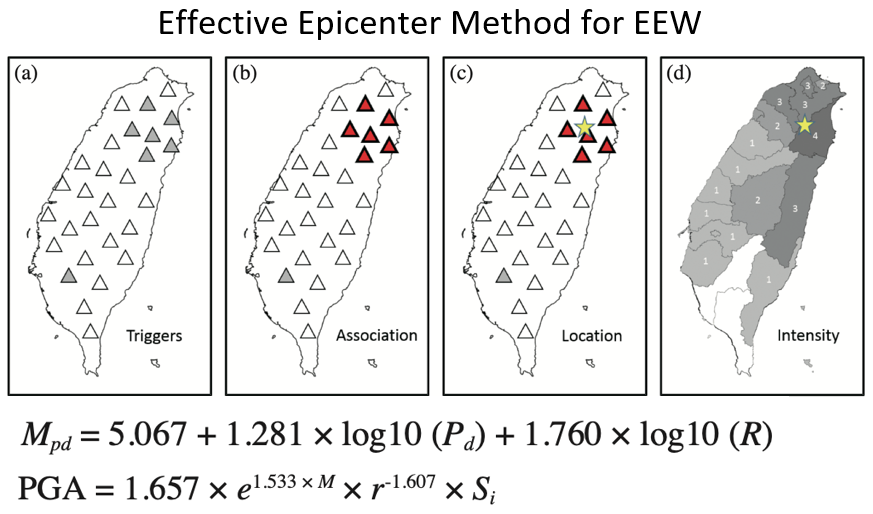
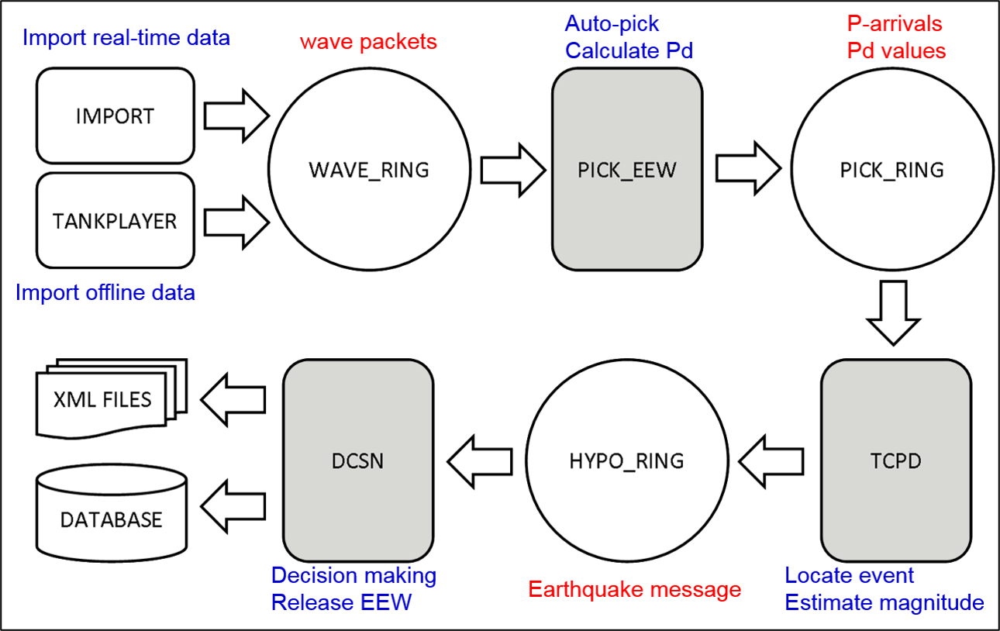
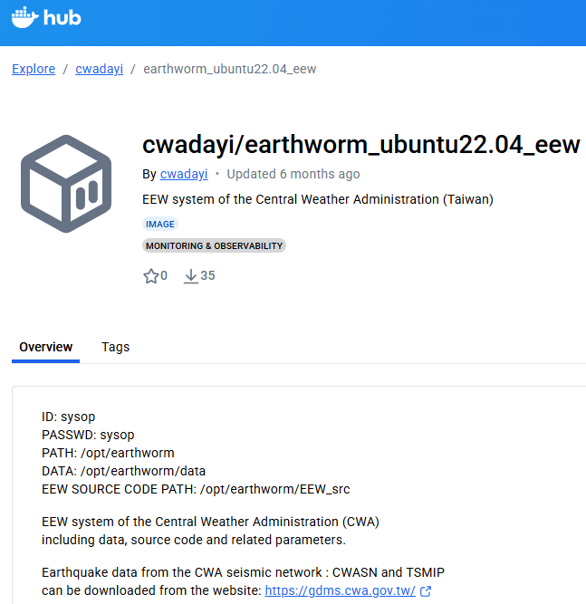
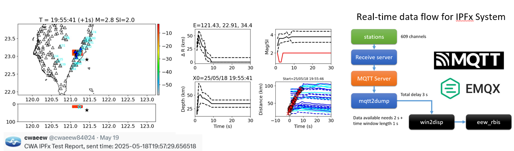

---
# /docs/eew.md (中文)
title: CWA 地震預警系統
layout: default
---

  <a href="en/eew.html"><strong>Switch to English</strong></a>

# ⚡ CWA 地震預警系統 (EEW)

地震預警 (Earthquake Early Warning, EEW) 系統的核心精神是「**與地震波賽跑**」。

它利用部署在震源附近的地震站，在地震發生的**最初幾秒內**偵測到訊號，快速解算地震資訊（位置、規模、各地預估震度），並搶在破坏性最強的地震波（S波）抵達各地之前，對可能遭受強烈搖晃的區域發布警報。

這個系統的目的是爭取**數秒至數十秒**的黃金應變時間，讓民眾、交通系統、重要設施能即時采取防護措施，以降低災害損失。

---

## 預警的科學原理：P波 vs. S波

地震會產生兩種主要的體波，它們的傳播速度不同，這是地震預警得以實現的物理基礎：

1.  **P波 (P-wave / 壓縮波):**
    * **速度快** (約 5-7 公里/秒)。
    * **振幅小**，造成的搖晃較輕微，通常不會致災。
    * 它是**第一批**抵達地表的地震波。

2.  **S波 (S-wave / 剪力波):**
    * **速度慢** (約 3-4 公里/秒)。
    * **振幅大**，是造成建築物破壞的**主要元兇**。
    * 它在 P 波之後抵達。

**黃金預警時間：**
EEW 系統就是捕捉到**先到**的 P 波，並立刻對外發出警報，搶在**後到**但破壞力強的 S 波抵達目標區域前。距離震央越遠，P波和 S波的抵達時間差就越大，可用的預警時間也就越長。

---

## CWA 預警系統總體架構

CWA 的地震預警系統是一個複雜且具高可用性的系統，其總體架構可分為四大階段：

*圖1：CWA 地震預警系統總體架構（左）與 2024 即時陸海觀測網（右）。*

如上圖（左）所示，系統流程如下：

1.  **資料蒐集 (RSD System):**
    此階段負責**蒐集外站即時資料**。資料來源即為圖（右）所示的「整合式即時陸海地震觀測網」（截至 2024 年共 632 個站點）。

2.  **平行解算 (EEW System):**
    為確保系統穩定與準確，CWA 採用**多套 EEW 系統平行運作**的機制。這些系統採用不同演算法（或相同演算法但不同參數），同時對收到的資料進行解算，包含：
    * **EEW-AI** (AI 演算法)
    * **IPFX System**
    * **eBear System** (包含 EEW1, EEW2, EEW3)
    * **ESE System** (FinDer, VS)

3.  **決策 (Decision):**
    所有平行運算的結果（地震參數）會被送入一個共同的決策系統 (如 `EEWRing`)，此系統會整合所有來源的資訊，做出「是否發布警報」的最終決策。

4.  **警報發布 (EEW Message Issue):**
    一旦決策系統決定發布警報，發布系統會透過**不同管道**將警報傳送出去，例如 `DCSN1`（EIP, 電視台）、`pwssend`（PWS 災防告警）等。

---

## 觀測網演進與預警時效

地震預警的成敗，與地震站的「**密度**」息息相關。**愈高密度的地震網，地震預警系統時效愈快，預警盲區的大小也隨之縮小。**

*圖2：CWA 即時地震觀測網的演進 (左: 2016年, 中: 2010年, 右: 2025年)*

如上圖所示，CWA 的即時地震觀測網規模大幅提升，達到了 2025 年的 **362 個強震站 (ACC)**、**19 個寬頻站 (VEL)** 及 **9 個海底地震儀 (OBS)** 的規模。

---

## 案例研究：2025 年大埔地震 (Dapu EQ)

觀測網的加密，直接反映在「盲區縮小」與「預警成效」上。

### 1. 盲區的縮小 (理論)

*圖3：以 2025 年大埔地震 (Dapu EQ) 的 P/S 波走時為例，展示預警盲區的縮小。*

這張圖顯示了 CWA 系統發布警報所需的「解算時間」不断在進步：

* **2010 (Jiasian 規模6.4):** 系統需 **27.0 秒**才能發布警報，導致預警盲區半徑長達 **86 公里**。
* **2016 (Meinong 規模6.6):** 系統縮短至 **12.0 秒**，盲區縮小至 **28 公里**。
* **2025 (Dapu 規模6.8):** 現今系統僅需 **7.9 秒**，盲區大幅縮小至 **12 公里**。

### 2. 預警成效：時間 (實戰)

下圖展示了 2025 年大埔地震的**實際預警成效**。

*圖4：2025 年大埔地震的預警成效熱圖（左）與觀測震度所用的 TSMIP 測站網（右）。*

* **圖左 (熱圖):** 顯示了地震發生後 60 秒內，全臺各地（依緯度）觀測到的「最大震度」隨「時間」的變化。
    * **垂直黃線:** 標示了 CWA 系統發布警報的時間點 (`1st Warning 7.9 s` 和 `2nd Warning 9.0 s`)。
    * **分析:** 雖然系統在地震發生後 7.9 秒才發出警報，但對於震央外圍、觀測到高震度（如 5+ 級、6- 級）的地區（緯度 23.3 至 24.3 之間），警報**仍然早於**強震動（綠色/黃色區塊）的抵達時間，成功提供了**數秒至數十秒**的提前告警。
* **圖右 (地圖):** 顯示了 CWA 用於觀測這場地震「實際震度」（即熱圖資料來源）的「臺灣強震儀器計畫 (TSMIP)」觀測網 (2024年，共 603 個即時站點)。

### 3. 預警成效：震度 (實戰)

除了「速度」快，「準確度」也同樣重要。下圖比較了 CWA 系統的「預估震度」與「觀測震度」。

*圖5：2025 年大埔地震的預估震度與觀測震度比較。*

* **(a) 第一次警報 (7.9 秒):** 系統發布的**預估震度圖**（範圍較廣，涵蓋 19 個城市）。
* **(b) 第二次警報 (9.0 秒):** 系統更新的**預估震度圖**（範圍縮小，涵蓋 1 個城市）。
* **(c) 觀測震度 (Catalog):** 地震後由所有 TSMIP 測站記錄到的**最終實際震度圖**。
* **(d) 第一次警報準確度:** 顯示「預估震度」與「觀測震度」的比較矩陣，**準確率高達 90%**。
* **(e) 第二次警報準確度:** 顯示第二次警報的比較矩陣，**準確率 83%**。

**結論：** 此案例證明 CWA 的 EEW 系統不僅能搶在強震動抵達前發出警報，其**預估震度的準確度也極高**，達到了 90% 的水準。

---

## 演算法之一：有效震央法 (Effective Epicenter Method)

在上述多套平行運作的系統中，CWA 的現行主力系統之一採用了「有效震央法」。此方法的核心精神是**速度**：

*圖6：有效震央法 (Effective Epicenter Method) 的四個步驟。*

如上圖所示，此方法完整展示了地震預警系統的自動化流程：

* **(a) 測站觸發 (Triggers):** P 波抵達，數個強震站（灰色三角）的 PGA 超過閾值。
* **(b) 站群關聯 (Association):** 系統透過在空間和時間上的篩選，將觸發站「關聯」起來（紅色三角）。
* **(c) 定位 (Location):** 系統計算這群觸發站的**幾何中心（黃色星號）**，將其視為「有效震央」。此方法**十分節省時間**，且能有效反映震動能量來源。
* **(d) 震度預估 (Intensity):** 一旦有效震央被決定，系統便會立即計算規模，並套用震度預估公式，評估全臺各地的預估震度（圖d）。

### 核心計算公式

**1. 地震規模 (<i>Mpd</i>) 計算**
系統利用 P 波前幾秒的垂直向位移 (<i>Pd</i>) 與震央距 (<i>R</i>) 來估算規模 <i>Mpd</i>：

**2. 預估震度 (PGA) 計算**
接著，系統使用估算出的規模 (<i>M</i>)、震央距 (<i>r</i>) 與測站場址效應 (<i>Si</i>) 來預估各地的地表峰值加速度 (PGA)：

---

### Earthworm 系統內的 EEW 資料流

上述的演算法，在 CWA 的 Earthworm 系統中是透過一系列模組化的資料流來實現的：

*圖7：CWA 地震預警系統在 Earthworm 內的資料流架構。*

1.  **資料匯入 (Import):** `IMPORT` 模組負責**匯入即時波形資料**。
2.  **波形環 (WAVE_RING):** 儲存即時的波形封包 (wave packets)。
3.  **P波偵測 (Auto-pick):** `PICK_EEW` 模組**自動挑選P波到時 (Auto-pick) 並計算P波振幅 (<i>Pd</i>)**。
4.  **P波資訊環 (PICK_RING):** 儲存 P波的到時與振幅 (<i>Pd</i> values)。
5.  **定位與規模 (Locate & Estimate):** `TCPD` 模組讀取 P 波資訊，執行「**地震定位**」與「**計算規模**」。
6.  **地震訊息環 (HYPO_RING):** 儲存解算完成的地震訊息 (Earthquake message)。
7.  **決策與發布 (Decision Making):** `DCSN` 模組讀取地震訊息，**預估全臺震度**，並做出**警報發布決策** (Release EEW)。
8.  **資料產出 (Output):** **發送警報**至下游單位，並寫入 `XML FILES` 與 `DATABASE` 存檔。

---

### 🐳 開源發布：Docker Hub 映像檔

為了促進學術交流與技術透明化，CWA 已將地震預警系統（包含 Earthworm 環境、EEW 原始碼、參數檔）打包成 Docker 映像檔，並發布於 Docker Hub 供大眾下載研究。

*圖8：CWA 地震預警系統 (cwadayi/earthworm_ubuntu22.04_eew) 的 Docker Hub 頁面。*

* **Docker Hub 映像檔名稱：**
    `cwadayi/earthworm_ubuntu22.04_eew`

此映像檔中已包含 CWA EEW 系統的**程式碼** (`EEW_src`)、相關**參數檔**與運作環境。研究人員可自行下載此映像檔，並搭配使用 CWA GDMS 網站的**測試資料**，進行系統的複現與研究。

---

## 進行中的計畫：IPFx 系統

如 CWA 預警系統總體架構（圖1）所示，CWA 同時運行多套演算法，IPFx 系統即為目前正在進行中 (ongoing project) 的先進系統之一。

*圖9：IPFx 系統的即時執行情形（左）與資料流架構（右）。*

此圖展示了 IPFx 系統的即時執行情形與架構：

* **即時執行情形 (圖左):**
    * **地圖 (左上):** 顯示了即時觸發的測站（紅色三角）與解算出的震央（黑色星號）。
    * **收斂圖 (中)：** 顯示了系統如何在事件發生後的幾秒內，快速收斂並穩定地震央距 (Δ R) 與深度 (Depth)。
    * **規模圖 (右上):** 顯示規模 (Mag/SI) 同樣在數秒內趨於穩定。

* **資料流架構 (圖右):**
    * **MQTT/EMQX:** 此系統採用了現代化的 **MQTT/EMQX** 訊息佇列技術來接收 609 個頻道的即時測站資料，展現了高效率與低延遲的特性。
    * **低延遲:** 資料總延遲 (Total delay) 僅約 3 秒，並在 1 秒的資料窗內即可開始處理。
    * **輸出:** 最終結果被送往 `win2disp`（即時波形顯示）與 `eew_rbis`（警報決策系統）進行後續處理。

---

## 警報發布管道、門檻與延遲

CWA 的警報發布採用「**分級**」策略，針對不同的管道（Channel）設有不同的發布門檻（Criteria）與延遲時間（Delay）：

| 管道 (Channel) | 發布門檻 (Dissemination Criteria) | 傳遞延遲 (Transmitting Delay) |
| :--- | :--- | :--- |
| **PWS** | 規模 <i>M</i> &ge; 5.0 <b>且</b> 震度 <i>I</i> &ge; 3   <b>或</b>   規模 <i>M</i> &ge; 6.5 <b>且</b> 震度 <i>I</i> &ge; 2 | 5.5 秒 |
| **TV** | 規模 <i>M</i> &ge; 5.0 <b>且</b> 震度 <i>I</i> &ge; 2 | 10–20 秒 |
| **DC** | 規模 <i>M</i> &ge; 4.5 <b>且</b> 震度 <i>I</i> &ge; 2 | 0.8 秒 |

 

**管道說明：**

* **PWS (Public Warning Service):**
    **災防告警細胞廣播**。這是傳送至民眾手機的國家級警報，門檻最高（通常需震度達 4 級，此處 <i>I</i> &ge; 3 為系統內部設定），以避免頻繁擾民。

* **TV (Television):**
    **電視台**。警報會以插播或跑馬燈形式出現在電視頻道上。

* **DC (Direct Connections):**
    **專線直連**。這是 CWA 直接傳送給**特定終端使用者**的**最快**警報，門檻也最低（規模 4.5 即可觸發）。
    * 這些使用者（約 3800 個）大多是**學校**、**防災機構**、**公共運輸系統（高鐵、捷運）**，以及 15 家向其客戶提供警報的防災企業。
    * 這解釋了為何有時 PWS 未響，但學校或大樓的警報卻已啟動。

---

### 相關連結

* **[返回首頁](index.html)**
* **[下一步：AI 輔助地震預警 (AI-EEW)](ai-eew.html)**