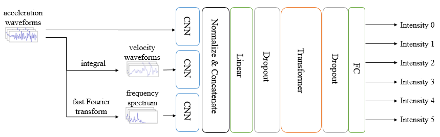
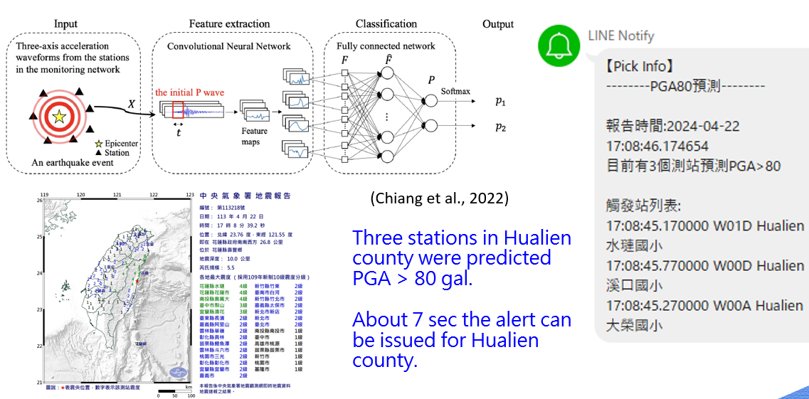
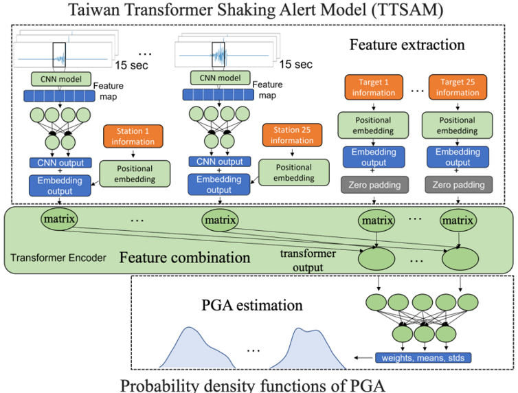
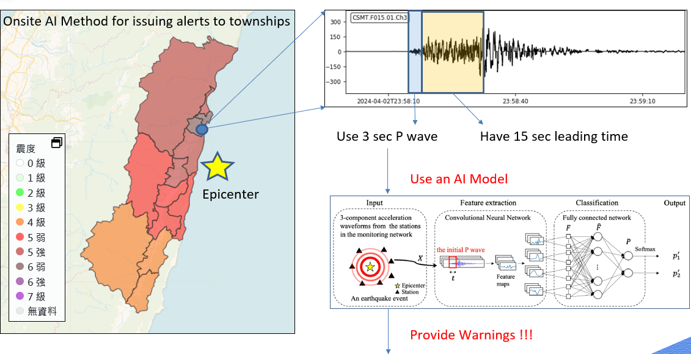

---
# /docs/en/ai-eew.md (English)
title: AI-Assisted Earthquake Early Warning
layout: default
---

  <a href="../ai-eew.html"><strong>切換至中文</strong></a>

# 🤖 AI-Assisted Earthquake Early Warning (AI-EEW)

Traditional Earthquake Early Warning (EEW) systems, like the "Effective Epicenter Method" discussed previously, face an inherent trade-off between speed and accuracy. To achieve the fastest possible alert, decisions must be made within the first few seconds of a P-wave's arrival, often with limited information.

To overcome this limitation, CWA is actively collaborating with research teams from **National Taiwan University (NTU)** to introduce **Artificial Intelligence (AI) and Deep Learning** technologies. The goal is to make faster *and* more accurate warning decisions in an even shorter amount of time.

---

## Core Goals of AI-EEW

The core objective of this collaboration is to leverage the powerful pattern-recognition capabilities of AI models to solve two major pain points of traditional algorithms:

1.  **Faster P-wave Detection:**
    * Traditional methods require triggers from multiple stations to be "associated" (e.g., by the `TCPD` module).
    * AI models (like CNNs or Transformers) are trained to **directly identify faint P-wave signals from a single station's real-time waveform** and instantly determine if it's a seismic event. This has the potential to significantly advance the "trigger time."

2.  **More Accurate Early Estimation:**
    * AI models can learn the complex, non-linear relationship between "waveform features in the first few seconds of a P-wave" and the "final earthquake magnitude/intensity."
    * This allows them to produce more robust magnitude and intensity estimations from a very short data window (e.g., 3-5 seconds) compared to traditional formulas (like the <i>Mpd</i> formula).

**The Ultimate Goal:** To use AI to further **reduce the warning processing time** (e.g., shortening it even more from 7.9 seconds) and **expand the effective warning area** (i.e., shrink the blind zone).

---

## AI R&D Example 1: Intensity Level Prediction Model

The figure below illustrates one of the "AI Intensity Prediction Model" architectures developed in collaboration with NTU. The core of this model is to **use only the first 3 seconds of P-wave data** to rapidly predict the station's final intensity.

*Figure 1: AI Earthquake Intensity Prediction Model Architecture (CNN + Transformer).*

As shown in the diagram, the model's workflow is as follows:

1.  **Multi-Feature Input:**
    The model uses not only the raw **acceleration waveforms** but also generates **velocity waveforms** (via integral) and the **frequency spectrum** (via Fast Fourier Transform).
2.  **Feature Extraction (CNN):**
    The three feature types are fed into separate Convolutional Neural Networks (CNNs) to extract key local patterns.
3.  **Integration & Transformation (Transformer):**
    The extracted features are **Normalized & Concatenated**. This combined feature set is then passed through a **Transformer** model to capture temporal relationships.
4.  **Output:**
    Finally, the model outputs probabilities corresponding to the **final intensity level** (Intensity 0 to Intensity 5+) that the station will observe.

---

## AI R&D Example 2: PGA Threshold Prediction (2024 Hualien EQ)

The figure below shows another example of using AI to predict PGA (Peak Ground Acceleration, a key metric for intensity) and its practical application during a 2024 Hualien earthquake.

*Figure 2: AI (CNN) model for predicting PGA > 80 gal (approx. Intensity 5+) and its application to the April 22, 2024 Hualien M5.5 Earthquake. (Chiang et al., 2022)*

This model's workflow is more direct:

1.  **Input:** The system receives **three-axis acceleration waveforms** (first 3 seconds of P-wave data) from a station that detected an event.
2.  **Feature extraction:** The P-wave data is fed into a **CNN (Convolutional Neural Network)**.
3.  **Classification:** The CNN extracts features, which are passed to a **Fully connected network** for classification. A Softmax function outputs the probability of whether the site's final PGA will exceed 80 gal (approx. Intensity 5+).

**Real-world Application (bottom-right):**
During the April 22, 2024 Hualien M5.5 earthquake, this AI system operated successfully:

* **LINE Notify Alert (top-right):** The system issued an alert at 17:08:46.174654, stating, "**3 stations in Hualien county were predicted PGA > 80 gal.**"
* **Performance:** As noted in the text, this AI system can **issue an alert for the Hualien county in about 7 seconds**, demonstrating the immense potential of AI in gaining precious warning time.

---

## AI R&D Example 3: Taiwan Transformer Shaking Alert Model (TTSAM)

Another advanced model in the CWA-NTU collaboration is the "Taiwan Transformer Shaking Alert Model (TTSAM)". This model's goal is to leverage the power of Transformers to integrate information from **multiple stations** to output a more precise probability distribution of PGA (Peak Ground Acceleration).

*Figure 3: Taiwan Transformer Shaking Alert Model (TTSAM) Architecture.*

1.  **Feature extraction:**
    * The 15-second waveform data from each of the 25 stations (Station 1... Station 25) is fed into its own CNN model to extract a "Feature map".
    * These features are combined with "Positional embedding" and "Target information" for each station.

2.  **Feature combination:**
    * The feature matrices from all stations are fed into a **Transformer Encoder**.
    * The Transformer's "self-attention mechanism" can dynamically weigh the importance of **different stations** at any given moment, effectively integrating global information about the seismic wavefield.

3.  **PGA estimation:**
    * Finally, the model outputs not just a single PGA value, but the **Probability density functions (PDFs) of PGA**.
    * This probabilistic output provides a much richer understanding of the prediction's uncertainty, offering more sophisticated data for future warning decisions.

---

## AI R&D Example 4: Onsite AI Warning Method

In addition to using AI for regional intensity prediction, CWA-NTU is also developing an "**Onsite AI Warning Method**," an even faster warning model designed specifically to **solve the epicentral blind zone problem**.

*Figure 4: Onsite AI Warning Method flow and performance diagram.*

As shown above, this method does not wait for multi-station association:

1.  **Single-Station Trigger:** A single station (blue circle) near the epicenter detects the P-wave.
2.  **Real-time AI Analysis:** The system extracts **only the first 3 seconds of the P-wave** (`Use 3 sec P wave`) and immediately feeds it into the AI model (the CNN model shown).
3.  **Township Alert:** The AI model **directly predicts** the intensity for the immediately surrounding townships (as shown on the left map) and issues a warning (`Provide Warnings !!!`).
4.  **Leading Time:** In this case study (2024-04-02 Hualien EQ), the method successfully provided **15 seconds of leading time** (`Have 15 sec leading time`) before the S-wave (strong shaking) arrived.

This Onsite method has extremely high value for issuing alerts within the **immediate epicentral area** (the traditional warning blind zone).

---

## 🚀 Interactive AI Warning Demo (Hugging Face)

To showcase the actual performance of the AI-EEW system, we have deployed the model on Hugging Face Spaces, featuring an interactive interface.

This demo allows you to select historical earthquake events and observe how the AI model analyzes waveforms in real-time, detects the P-wave, and rapidly provides estimations of magnitude and intensity.

> **[Please replace `[PASTE_YOUR_AI_EEW_HF_SPACE_LINK_HERE]` below with your Hugging Face Space URL]**

<iframe
	src="[PASTE_YOUR_AI_EEW_HF_SPACE_LINK_HERE]"
	frameborder="0"
	width="100%"
	height="1000"
></iframe>

---

### Related Links

* **[Back to Home](index.html)**
* **[Back: CWA Earthquake Early Warning (EEW)](eew.html)**
* **[Next: Live Booth Demo](live-demo.html)**