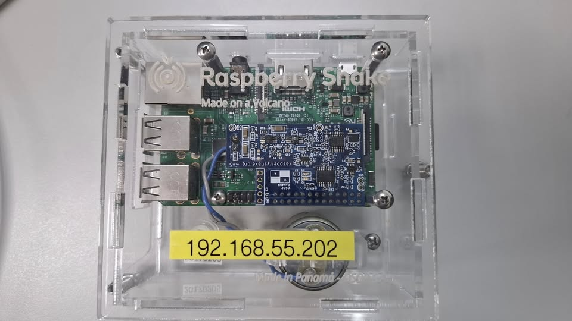

---
# /docs/en/live-demo.md (English)
title: Live Booth Demo
layout: default
---

  <a href="../live-demo.html"><strong>切換至中文</strong></a>

# 📡 Live Booth Demo

Welcome to our booth! Here, we put theory into practice by demonstrating a complete, real-time seismic monitoring system.

In addition to the professional-grade CWA network shown on the `network.md` page, we have also set up a **"demonstration-only"** live monitoring system at our booth. It is powered by a **Raspberry Shake 1D** seismometer and a **Raspberry Pi**.

> **Important Note:** The Raspberry Shake at this booth is **not the official seismometer model used in CWA's operational network**. It is here purely for demonstration purposes to show live seismic waveforms and the concept of citizen seismology.

---

## What is a Raspberry Shake?

The Raspberry Shake is a popular "citizen seismograph." It combines a professional-grade seismic sensor (a vertical 1D geophone) with a Raspberry Pi single-board computer. This allows schools, hobbyists, and professionals like us to set up their own low-cost seismic station and stream data to global monitoring networks.

This connects back to the R&D efforts mentioned on the `network.md` page, where CWA is actively researching the application of Raspberry Pi in seismic instrumentation.

---

## What Can You See at the Booth?

The screen at our booth is displaying the **live, real-time seismic waveform** being detected by this Raspberry Shake right now.

*Figure 1: The Raspberry Shake 1D (in its clear case) on display at our ACES booth. This instrument is detecting local ground motion in real-time.*

* **Live Ground Motion:** The waveform you see is the actual vibration of the ground, right here, right now.
* **The "Stomp Test":** We invite you to **stomp your foot** hard on the floor next to the booth! You will immediately see the waveform on the screen spike—you've just created your own "artificial earthquake"!

This demonstration allows you to experience firsthand how sensitively a seismometer captures the slightest ground motion, **simulating** the work that CWA's 600+ **professional stations** across Taiwan are doing 24/7.

---

### Related Links

* **[Back to Home](index.html)**
* **[Back: AI-Assisted EEW](ai-eew.html)**