---
# /docs/en/network.md (English)
title: CWA Seismic Network
layout: default
---

<strong>[切換至中文](../network.md)</strong>

# 🛰️ CWA Seismic Network

Taiwan is located on the Ring of Fire, experiencing extremely frequent seismic activity. To grasp real-time ground motion information across the island, the Central Weather Administration (CWA) has built and operates a **high-density**, **real-time**, modern seismic network.

This network is the **most critical cornerstone** for all of Taiwan's earthquake reports, Earthquake Early Warning (EEW) services, and seismological research.

---

## Composition of the Network

CWA's seismic network is primarily composed of two major parts: the "Taiwan Strong Motion Instrumentation Program (TSMIP)" and the "CWA Core Seismographic Network (CWASN)."

### 1. Taiwan Strong Motion Instrumentation Program (TSMIP)

TSMIP is CWA's most extensive and densely deployed network, reaching deep into metropolitan areas, schools, and critical facilities. As of 2024, this program includes:

* **OnLine Stations: 603**
    These stations transmit ground acceleration data in real-time, 24/7. They are the core data source for **Earthquake Early Warning (EEW)** and **Felt Earthquake Reports**, allowing us to assess local intensities very shortly after an earthquake.

* **OffLine Stations: 115**
    Data from these stations is primarily used for post-earthquake scientific research, hazard analysis, and structural response assessment.

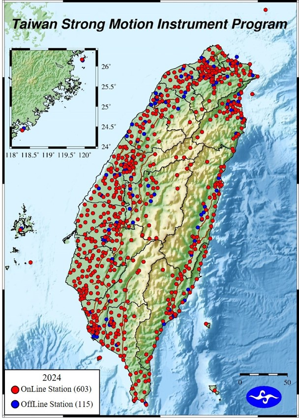
*Figure 1: TSMIP station distribution map (2024). Red dots are OnLine Stations (603), blue dots are OffLine Stations (115).*

---

### 2. CWA Core Seismographic Network (CWASN)

This is CWA's high-precision scientific monitoring network, used for accurate earthquake location, magnitude calculation, and focal mechanism analysis. As of 2024, its main components include:

* **SMT/S-13 Stations (112):** Form the backbone of high-dynamic-range observation.
* **BoreHole Stations (94):**
    Installed tens to hundreds of meters below the surface, they effectively **reduce surface noise** and detect weaker seismic signals.
* **BroadBand Stations (10):**
    High-sensitivity instruments that record full-frequency waveforms, crucial for accurately calculating moment magnitude ($M_w$) and for scientific research.
* **Ocean Bottom Seismometers (OBS) (9):**
    Deployed off the eastern coast of Taiwan, they **significantly enhance** the monitoring capability for earthquakes in Taiwan's eastern offshore and subduction zone.

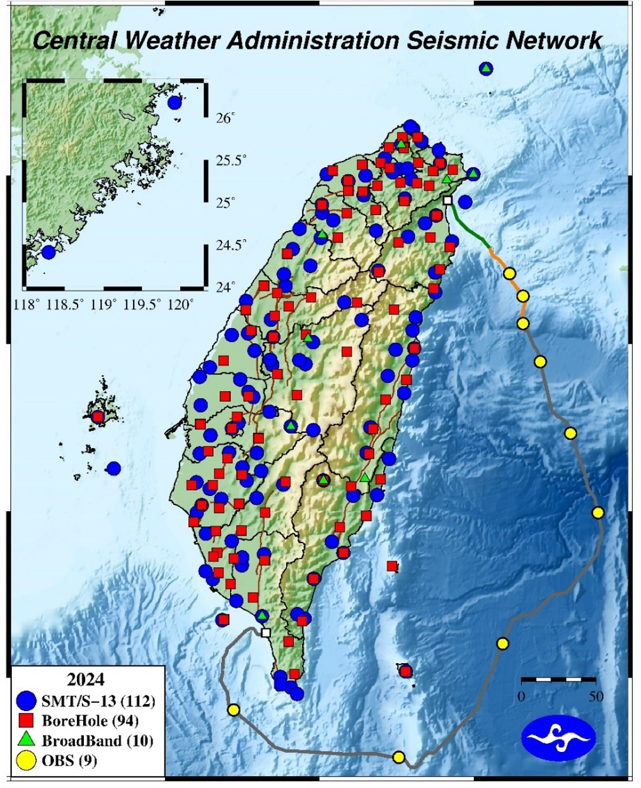
*Figure 2: CWASN station distribution map (2024).*

---

## 🧠 Operations Hub: Seismological Center

All seismic signals from hundreds of real-time observation stations across Taiwan converge 24/7 at the CWA's "Seismological Center."

*Figure 3: CWA Seismological Center.*

This is the heart of Taiwan's earthquake monitoring and warning operations. Staff and automated systems continuously monitor ground motion signals from the entire island, performing these key tasks:

* **Real-time Monitoring:** Watching live waveforms and station connection statuses.
* **Automated Processing:** Automated systems instantly solve for earthquake location, magnitude, and local intensities.
* **Warning Dissemination:** When an earthquake meets the warning threshold, the system automatically issues a public strong-motion alert (EEW).
* **Report Generation:** Within minutes of an earthquake, staff perform a manual review and issue the official felt earthquake report.

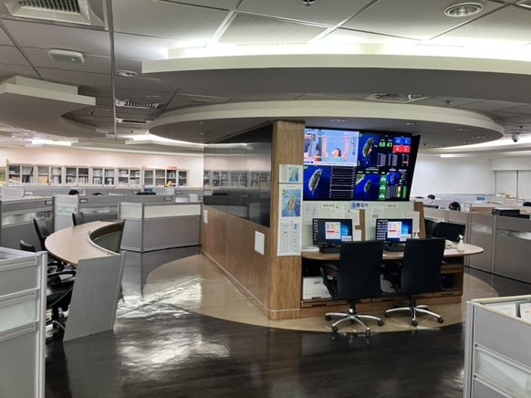
*Figure 4: The Seismological Center operations floor, where staff monitor seismic activity and warning systems 24/7.*

---

### Earthquake Publishing Platform and Dashboard

The center's publishing platform integrates multiple real-time data streams, clearly presented on large dashboards, ensuring that decision-makers and on-duty staff can quickly grasp the situation.

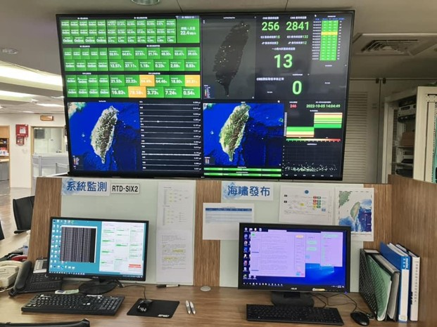
*Figure 5: The Earthquake Publishing Platform, displaying real-time data, station status, and event info, serving as the core interface for decision-making.*

The large displays show:

* **Station Health Status:** Ensuring all observation stations are operational.
* **Real-time Map Display:** Showing the latest earthquake event locations and impact areas.
* **Warning Status:** Displaying the progress and coverage of any active warnings.
* **Recent Earthquakes:** Providing a review of recent seismic activity.

These visual interfaces make complex seismic information understandable at a glance and are indispensable tools for efficient earthquake response.

---

### ⚙️ Real-time Data Platform Architecture

The aforementioned dashboards and applications are all built upon a stable, multi-layered real-time data platform. This platform is responsible for processing the massive data streams from hundreds of domestic and international stations.

*Figure 6: CWA Real-time Data Platform architecture, showing the complete flow from data source, receiving, integration, to application.*

### Core Open-Source Software

CWA's platform, like many top seismic centers worldwide, is built on powerful, proven open-source software. The two core systems are Earthworm and SeisComP.

**Earthworm:**

Earthworm is a modular, real-time seismic data processing system designed for monitoring and warning. It uses a "Shared Memory Rings" architecture, allowing various independent modules (e.g., data acquisition, phase picking, data exchange) to work together efficiently.

**As shown in the "Data Integration" layer of the architecture (Fig. 6)** (e.g., `Layer2a-1` modules), Earthworm is the core middleware CWA uses to integrate real-time data from multiple sources and distribute it to backend applications.

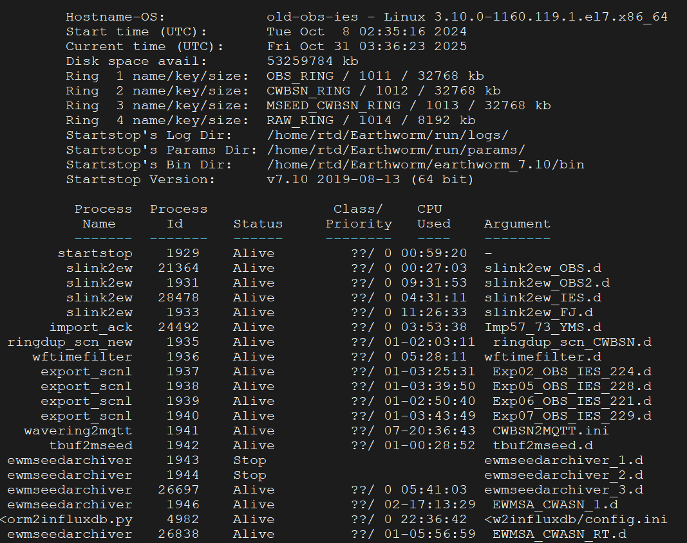
*Figure 7: The `startstop` monitoring screen of a CWA Earthworm system in operation. It shows various data rings (e.g., `OBS_RING`, `CWBSN_RING`) and running processes (e.g., `slink2ew`, `ewmseedarchiver`).*

 

**SeisComP (Seismological Communication Processor):**

Developed by GFZ Germany, SeisComP is an extremely powerful global seismological monitoring system. It provides a complete solution from data acquisition, real-time processing, automatic event location, and magnitude calculation to data dissemination. CWA also implements such advanced open-source technologies to enhance its automated processing and monitoring capabilities.

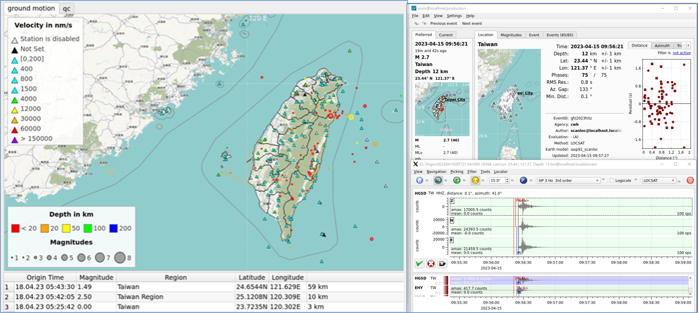
*Figure 8: CWA's SeisComP GUI for earthquake analysis. The interface integrates real-time station maps, intensity displays, event lists, waveform inspection, and source parameter solutions, serving as a powerful tool for seismologists.*

---

As the architecture diagram shows, the platform is divided into four main layers:

1.  **Data Source:**
    Receives raw seismic data from CWA's own networks (e.g., Geotech, Nanometrics), partner institutions (e.g., IES, NEC, Gurlap), and international data centers (e.g., IRIS).

2.  **Data Receiving:**
    Uses multiple VM clusters (L-VM, W-VM) to receive, parse, and preliminarily process data from various formats (e.g., nano-CSMT, OBS, Geotech) in real-time.

3.  **Data Integration:**
    The received raw data streams are standardized, exchanged, and distributed via middleware like **Earthworm** (Layer2), and backed up to the Backup Center.

4.  **Data Application:**
    The final integrated data streams are fed to various application systems, including:
    * **Earthquake Early Warning (EEW):** (e.g., EEW1, EEW2, EEW3...)
    * **Monitoring Dashboards:** (e.g., Grafana, CWB24-Monitor)
    * **Waveform & Data Services:** (e.g., GDMS-FDSN, N-SCP-1)
    * **Township Intensity & Reporting:** (e.g., Township-Center, RTD Computers)

### Application Example: Grafana System Real-time Monitoring

In the "Data Application" layer, monitoring dashboards play a critical role in ensuring system health. CWA uses tools like **Grafana** to build custom dashboards to monitor station data transmission status.

**1. Onshore Station Latency Monitoring**

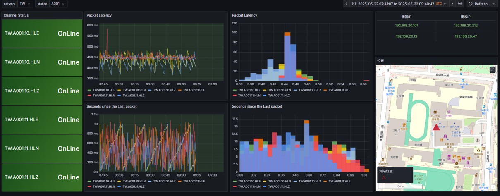
*Figure 9: A Grafana dashboard built for real-time status of onshore stations.*

This dashboard shows how CWA monitors the health of every single data channel:

* **Channel Status:** Shows if a station is `OnLine`.
* **Packet Latency:**
    **Critical for EEW**. The dashboard plots transmission latency for each data packet in milliseconds (ms), ensuring data immediacy.
* **Seconds since the Last packet:**
    Another key health metric to ensure the data stream is not interrupted.
* **Geo-info:**
    Integrates `Instrument IP` and station `Location` maps, allowing staff to quickly pinpoint issues.

**2. OBS (Ocean Bottom Seismometer) Real-time Monitoring**

Grafana is also used to monitor real-time data from the OBS deployed off the coast of Taiwan.

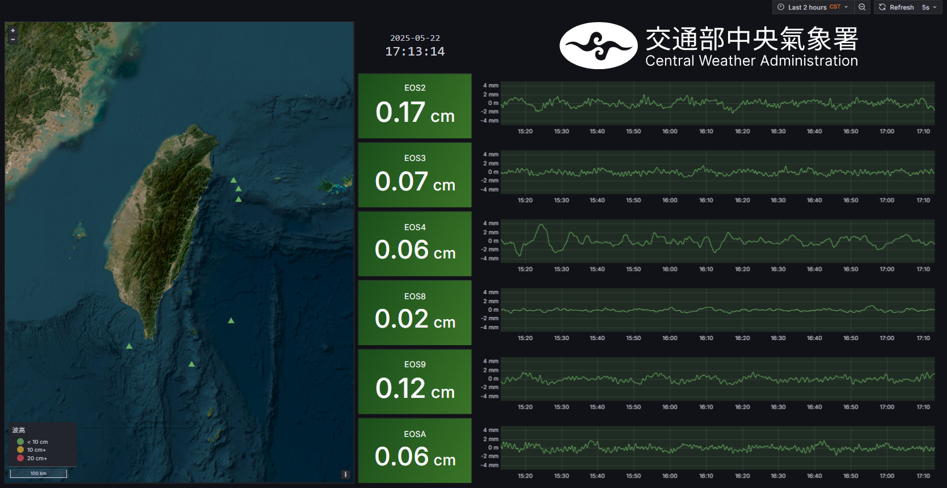
*Figure 10: A Grafana dashboard for real-time OBS pressure gauge data.*

This dashboard is crucial for monitoring offshore earthquakes and tsunami potential:

* **Real-time Map:** The left map shows OBS station locations (green triangles).
* **Pressure Gauge Data (cm):** The right side shows real-time pressure readings (in cm) from different OBS stations like `EOS2`, `EOS3`, etc.
* **Real-time Waveforms:** Live waveform data from each station allows staff to observe pressure changes on the seafloor in real-time.

**3. Overall System Health Dashboard**

CWA aggregates all key metrics into a high-level "Overall System Dashboard" to give on-duty staff an "at-a-glance" view of the entire system's health.

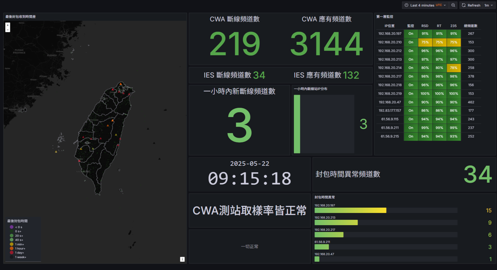
*Figure 11: CWA Real-time Data Platform - Overall System Health Dashboard.*

This dashboard summarizes all system KPIs:

* **Live Map:** Top-left map shows "last packet received" time for all stations; anomalous stations (red, orange) are highlighted.
* **Channel Counts:** Total connection counts for "new/old" channels from different sources like CWA and IES.
* **Server Status:** The `First-Layer Monitoring` table lists all data-receiving servers (IPs) and their health, connection quality (RSD, RT), and channel counts.
* **Anomaly Stats:** `Packet Time Anomaly Count` (e.g., 34) and their sources, allowing operators to quickly focus on problems.
* **Overall Status:** A final "All Clear" (e.g., "CWA station sampling rate normal") gives staff the most direct assessment.

**4. EEW Publishing Status**

Beyond monitoring data, Grafana is also used to monitor the "application" layer itself—specifically, the CWA's EEW system decision-making and publishing status.

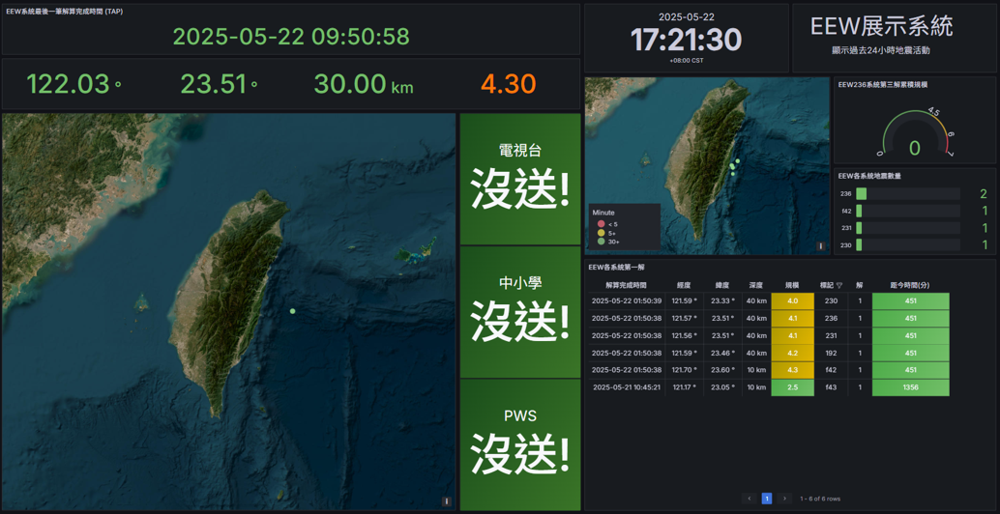
*Figure 12: CWA Earthquake Early Warning (EEW) Display System Dashboard.*

This dashboard provides a real-time snapshot of the EEW system's operations:

* **Latest Event:** Left side shows the parameters of the most recent event trigger (e.g., 2025-05-22, Magnitude 4.30).
* **Publishing Decision:** Clearly shows **if** the event triggered alerts for "TV Stations," "Schools," and "PWS" (Public Warning System).
* **Decision Status:** The "沒送!" (Not Sent!) indicates this M4.3 earthquake **did not meet** the threshold for a public alert, meaning the system made the correct decision.
* **System Summary:** The right side summarizes the total number of EEW triggers, solved events, and an event list for the last 24 hours.

**5. Single-Station Real-time Waveform Monitoring**

Grafana's ultimate application returns to the fundamentals of seismology: watching live waveforms. CWA also builds dashboards for specific, critical stations.

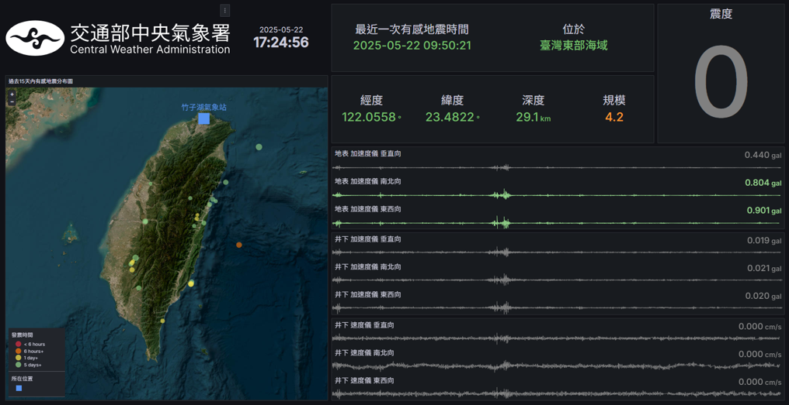
*Figure 13: CWA real-time data dashboard for a specific station (Tzihzihu Weather Station).*

This dashboard lets staff drill down into a single station's details:

* **Station Map:** Left map highlights the currently selected "Tzihzihu Weather Station".
* **Latest Earthquake:** Top bar shows the parameters of the "Last Felt Earthquake" (e.g., M 4.2, Intensity 0).
* **Real-time Waveforms:**
    The right side displays the station's **most critical real-time data**:
    * **Surface** 3-component acceleration (gal).
    * **Borehole** 3-component acceleration (gal).
    * **Borehole** 3-component velocity (cm/s).
    
    This is vital for comparing borehole instruments (cleaner signal) with surface instruments (true intensity) and for analyzing event-specific waveforms.

> **🎥 Watch it Live (YouTube):**
>
> * **[Click to watch "Real-time Data from a Specific Station" on YouTube](https://www.youtube.com/watch?v=H4BDfxgeNHw)**

**6. Island-wide Real-time Strong-Motion Waveform Monitoring**

Finally, CWA aggregates key strong-motion waveforms from across Taiwan onto a single dashboard, allowing staff to quickly survey island-wide ground motion.

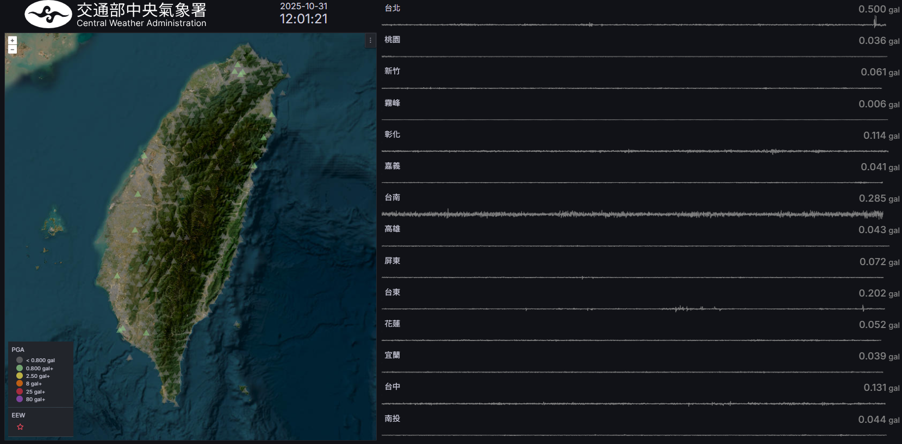
*Figure 14: CWA Island-wide Real-time Strong-Motion Waveform Dashboard.*

This dashboard provides a "common operational picture" of ground motion:

* **PGA Map:** Left map shows the real-time "Peak Ground Acceleration (PGA)" distribution from all stations, the most intuitive tool for assessing intensity.
* **Multi-Station Waveforms:** The right side displays "drum plots" of real-time surface acceleration (gal) from all major stations (Taipei, Taoyuan, Hsinchu, Taichung, Chiayi, Hualien, etc.).
* **Real-time Triage:** Staff can use this to quickly determine if an event is "regional" or "island-wide" and see which areas are shaking the most.

> **🎥 Watch it Live (YouTube):**
>
> * **[Click to watch "Island-wide Real-time Strong-Motion Stations" on YouTube](https://www.youtube.com/watch?v=B3JC0DOQmxk)**

---

## 💡 Innovation & R&D

Beyond maintaining a stable network, CWA is actively engaged in innovative R&D and academic exchange.

*Figure 15: CWA's innovation in seismic observation and academic presentations.*

* **Innovation (R&D):**
    In recent years, CWA has been actively researching the use of **Raspberry Pi** and other low-cost, flexible single-board computers (SBCs) for seismic instrumentation and data acquisition. The top row of the image shows R&D prototypes combining Raspberry Pi with various seismometers (like Raspberry Shake).

* **Practical Application:**
    The bottom row shows live test displays of these R&D efforts within the Seismological Center, including real-time waveform monitoring and staff discussions.

* **Academic Exchange:**
    The QR Code in the center links to CWA's presentation on its seismic network at the **2025 JpGU (Japan Geoscience Union) meeting**, sharing CWA's latest achievements with the international community.

---

## Main Functions of the Network

This powerful, layered network, orchestrated by the Seismological Center, supports three core missions:

1.  **Earthquake Early Warning (EEW):**
    Using real-time strong-motion stations (TSMIP) near the source, alerts are issued to target areas before the destructive S-waves arrive.

2.  **Rapid Reports & Intensity Maps:**
    Within minutes of an earthquake, rapid reports (time, location, depth, magnitude) and observed intensity maps are generated for the public and disaster response units.

3.  **Seismological Research:**
    The accumulated high-quality data (especially from CWASN) is fundamental to understanding Taiwan's tectonic structure, fault activity, and developing next-generation seismic science models.

---

## 📚 Data Services

CWA not only focuses on real-time monitoring but also makes its valuable seismic data available to academia and the public to promote the advancement of earth sciences.

*Figure 16: CWA Taiwan Geophysical Database Management System (GDMS) Portal.*

CWA seismic data is **free to use**. All data (including CWASN, TSMIP, TGNS, etc.) can be queried and downloaded via the "Taiwan Geophysical Database Management System (GDMS)."

* **Website:** [https://gdms.cwa.gov.tw/](https://gdms.cwa.gov.tw/)
* **Access:** Requires free registration and login.
* **Data Latency:** To ensure the stability of real-time systems, data provided via GDMS has a 15-minute delay.

---

### Related Links

* **[Back to Home](index.md)**
* **[Learn about CWA Earthquake Early Warning (EEW) System](eew.md)**