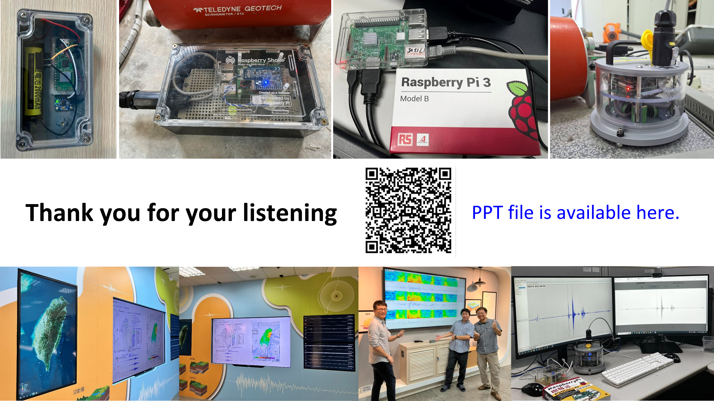
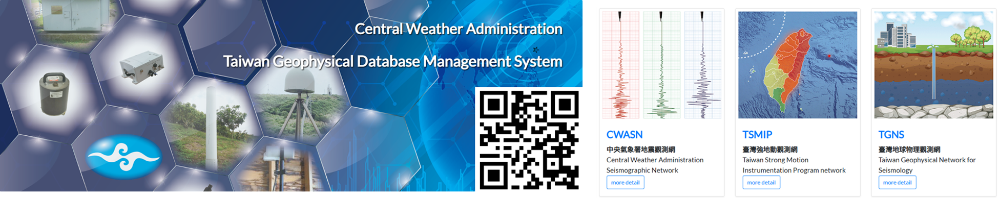

---
# /docs/network.md (中文)
title: CWA 地震觀測網
layout: default
---

<strong>[Switch to English](en/network.md)</strong>

# 🛰️ CWA 地震觀測網 (CWA Seismic Network)

臺灣位於環太平洋地震帶，地震活動極為頻繁。為了即時掌握全島的地動資訊，中央氣象署 (CWA) 建構並維運著一套**高密度**、**高即時性**的現代化地震觀測網。

這個觀測網是臺灣所有地震報告、地震預警 (EEW) 服務以及地震科學研究的**最重要基石**。

---

## 觀測網的組成
( ... 內容與您之前提供的16張圖+2影片版本完全相同 ... )
( ... 這裡省略了200多行您已確認的內容 ... )

---

## 💡 創新應用與學術交流 (Innovation & R&D)

除了維運穩定的觀測網，CWA 亦積極投入創新研發與學術交流。

*圖15：CWA 於地震觀測的創新研發與學術簡報。*

* **創新研發 (R&D):**
    近年來，CWA 積極投入將 **Raspberry Pi (樹莓派)** 等低成本、高彈性的單板電腦 (SBC) 應用於地震儀器與資料擷取的研究。圖中（上排）展示了使用 Raspberry Pi 結合不同地震儀（如 Raspberry Shake）的研發測試原型。

* **實務應用：**
    圖中（下排）顯示了這些研發成果在地震測報中心內的實際測試畫面、即時波形監控，以及同仁的研討情況。

* **學術交流 (Academic Exchange):**
    圖中央的 QR Code 連結為 CWA 於 **2025 年 JpGU (Japan Geoscience Union) 研討會**發表的地震觀測網簡報，與國際分享 CWA 在此領域的最新成果。

---

## 觀測網的主要功能

这个強大且分層的觀測網絡，在地震測報中心的調度下，支持著三大核心任務：

1.  **地震預警 (EEW):**
    利用部署在震源附近的即時強震站 (TSMIP)，搶在破壞性 S 波抵達各地前，向目標區域發布警報。

2.  **地震速報與震度報告:**
    地震發生後數分鐘內，快速產出地震報告（發震時間、位置、深度、規模）與各地的觀測震度圖，供民眾與救災單位參考。

3.  **地震科學研究:**
    所有高品質的觀測資料（-^來自 CWASN 的資料），是了解臺灣地體構造、斷層活動性以及發展新一代地震科學模型的基礎。

---

## 📚 地震資料開放與服務 (Data Services)

中央氣象署不僅致力於即時觀測，也將寶貴的地震觀測資料開放給學術界與公眾使用，以推動地震科學的發展。

*圖16：CWA 臺灣地球物理資料庫管理系統 (GDMS) 入口網站。*

CWA 地震資料**歡迎免費使用**，所有資料（包含 CWASN, TSMIP, TGNS 等）皆可透過「臺灣地球物理資料庫管理系統 (GDMS)」進行查詢與下載。

* **服務網址：** [https://gdms.cwa.gov.tw/](https://gdms.cwa.gov.tw/)
* **使用條件：** 需註冊後登入。
* **資料延遲：** 為確保即時系統的穩定，GDMS 提供的即時資料有 15 分鐘的延遲。

---

### 相關連結

* **[返回首頁](index.md)**
* **[深入了解 CWA 地震預警 (EEW) 系統](eew.md)**